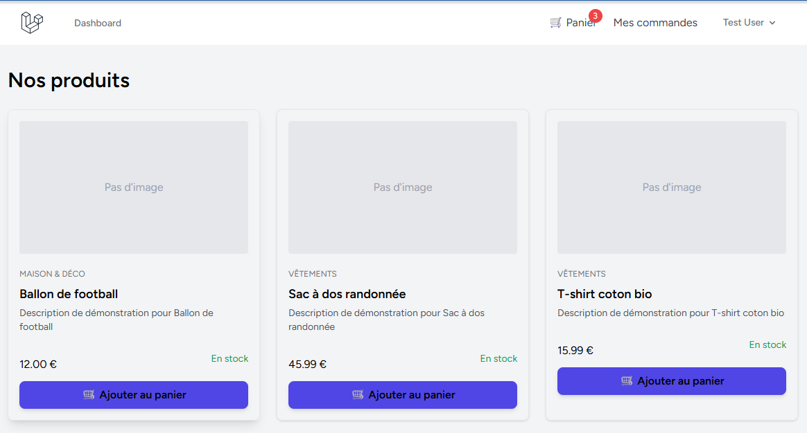
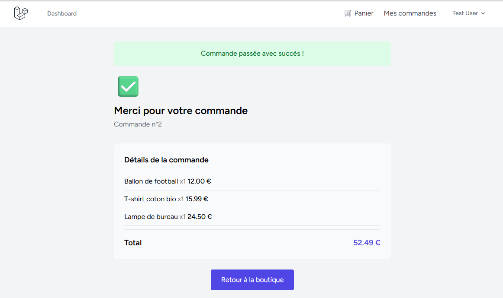
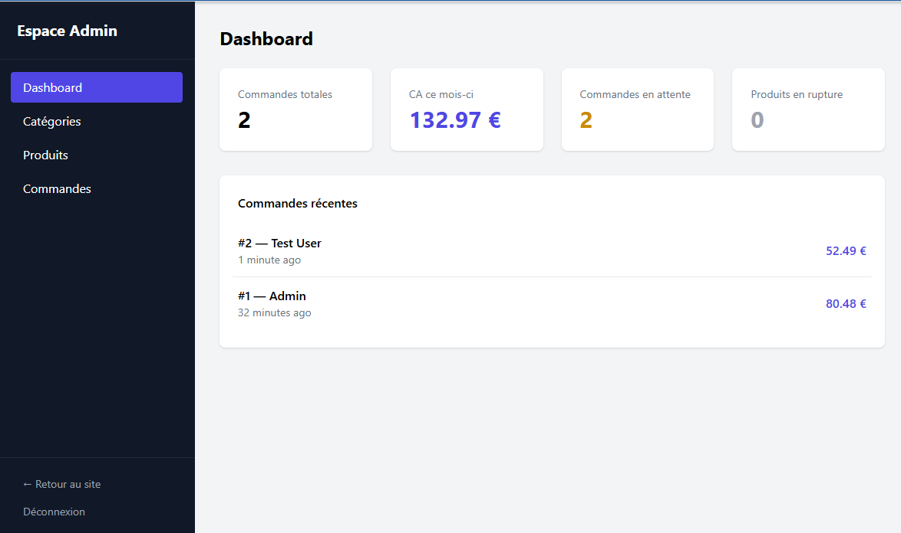

# 🛍️ Mini E-commerce — Laravel

Une plateforme e-commerce complète développée avec Laravel, incluant un catalogue produits, un panier dynamique, un tunnel de commande, et un espace d'administration complet.

## 🔗 Démo en ligne

👉 **[Voir le site en ligne](https://mini-ecommerce-09i8.onrender.com)**

⚠️ Le site est hébergé sur un plan gratuit : le premier chargement peut prendre 30 à 60 secondes si le site était inactif.

### Identifiants de test

| Rôle | Email | Mot de passe |
|---|---|---|
| Client | test@example.com | password |
| Admin | admin@example.com | password |

## ✨ Fonctionnalités

**Côté client**
- Catalogue de produits avec catégories
- Panier dynamique (ajout, modification, suppression) sans rechargement de page
- Tunnel de commande complet avec gestion d'adresse
- Historique des commandes personnelles
- Authentification (inscription / connexion)

**Côté administration**
- Dashboard avec statistiques (chiffre d'affaires, commandes, stock)
- Gestion des catégories (CRUD)
- Gestion des produits avec upload d'images (CRUD)
- Gestion des commandes avec changement de statut
- Accès protégé par rôle (client / admin)

## 🛠️ Stack technique

- **Backend** : Laravel 12, PHP 8.2
- **Frontend** : Blade, Alpine.js, Tailwind CSS
- **Base de données** : PostgreSQL (production) / MySQL (développement local)
- **Authentification** : Laravel Breeze
- **Déploiement** : Docker, Render

## 📸 Aperçu






## 🧠 Choix techniques

- **Panier géré en session (pas en base de données)** : permet à un visiteur d'ajouter des produits sans créer de compte, réduisant la friction avant l'achat. Le panier n'est lié à un compte qu'au moment du checkout.
- **Vérification du stock au moment du checkout, pas seulement à l'affichage** : évite la survente si le stock a changé entre la consultation du produit et la validation de la commande.
- **Transaction de base de données sur la création de commande** : garantit qu'une commande n'est jamais enregistrée partiellement (commande créée sans ses articles, par exemple) en cas d'erreur en cours de traitement.
- **Upload d'image avec conservation en cas de non-modification** : lors de l'édition d'un produit, l'image existante est préservée si l'admin ne fournit pas de nouveau fichier.
- **Accès admin par rôle, pas par sous-domaine séparé** : simplifie le déploiement tout en gardant une séparation stricte des permissions via middleware.

## ⚙️ Installation locale

```bash
git clone https://github.com/zzres/mini-ecommerce-laravel.git
cd mini-ecommerce-laravel

composer install
npm install

cp .env.example .env
php artisan key:generate

# Configurer la base de données dans le fichier .env

php artisan migrate --seed
npm run build

php artisan serve
```

## 👤 Auteur

Développé par Alvain Junior Saminzere Zero 
Retrouvez-moi sur [Codeur.com](https://www.codeur.com/-alvainz23) pour vos projets de développement web.